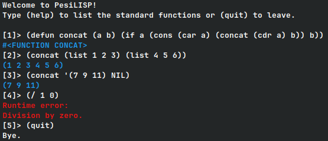

# PesiLISP

PesiLISP — a perfectly simple LISP interpreter. An educational project aiming to implement a basic interpreter for a LISP-like programming language.

## Features
- REPL mode and script execution
- recursive descent parser
- `INTEGER`, `CONS`, `SYMBOL`, `FUNCTION`, `T`, `NULL` types
- reference counting for all objects except `T` and `NIL`
- single namespace for variables and functions (Scheme-like)
- basic arithmetic, boolean, list and I/O functions, `IF`, `COND`, `LET`, `LET*`
- `DEFUN` and `LAMBDA` with environment capture
- function return value caching (memoization) with automatic side effect detection

There are no mutable variables in the language, so it can be considered purely functional. Iterative algorithms have to be implemented with recursion.

## Samples


You can find several sample scripts in the [samples directory](./samples).

## Build
To build the project you need a make program and a C compiler. 
`cd` into the project directory and run:
```sh
make
```
